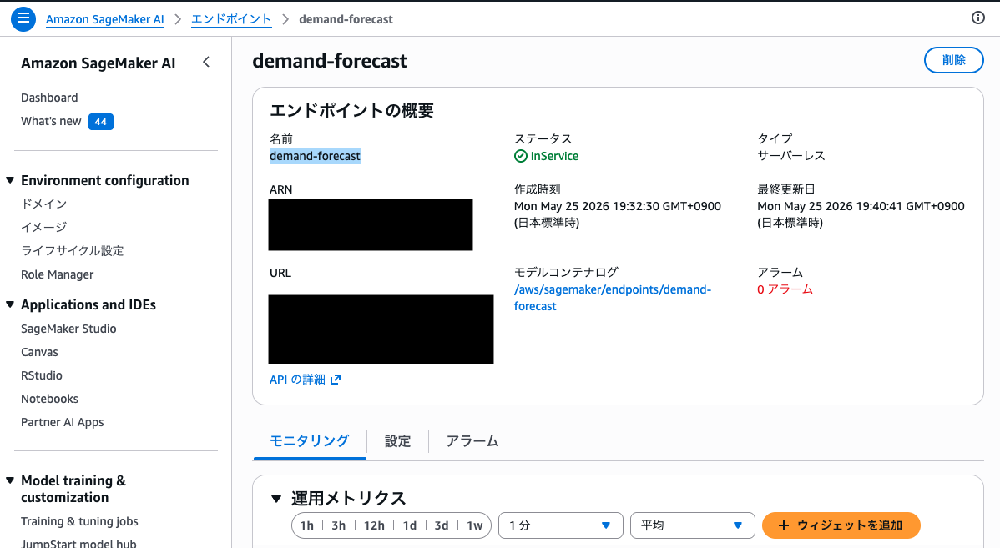
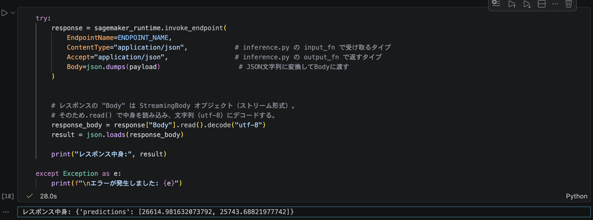

# demand-forecast-sagemaker-deploy
Custom LightGBM Inference Container on Amazon SageMaker

`electricity-demand-forecast` で作成した需要予測モデルを、Amazon SageMaker にデプロイしました。  
LightGBM を使った自作モデルを、カスタム推論コンテナとして構築し、サーバーレスエンドポイントで動かしました。

最終的に、
- カスタム推論コンテナ作成
- ECR push
- SageMaker Endpoint deploy
- boto3 invoke_endpoint()

まで動作確認しました。

---

# What I tried

- 自作モデルを使ったカスタムコンテナの作成
- `sagemaker-inference` の導入
- 推論頻度が低く、常時インスタンス起動コストを避けたかったため、
SageMaker Serverless Inference を採用
- ローカル notebook から `SageMaker Runtime` 経由でエンドポイントの動作確認

## アーキテクチャ概要

```
Local Notebook
    ↓ invoke_endpoint()
SageMaker Endpoint
    ↓
Custom Inference Container
    ↓
LightGBM model.predict()
```

## エンドポイント作成後

- SageMaker コンソールで `InService` を確認
  

- ローカル notebook から推論リクエストを実行


---

# カスタム推論コンテナで詰まったところ

SageMaker では独自 HTTP サーバーを立てるよりも、`sagemaker-inference` の標準フローへ寄せた方が  
保守性・互換性が高いと判断し、FastAPI などは使いませんでした。  
そのため、`sagemaker-inference` を利用してスクラッチで推論コンテナを構築しています。

構成自体はシンプルですが、実際にはいくつかハマりどころがありました。  
特に「CloudWatch にログすら出ない」という状態から原因を切り分けるのが大変だったため、  
詰まったポイントと対応内容を備忘録的にまとめます。  
（あくまで私の環境での解決例であり、よりスマートな方法もあると思いますが、私のようにDocker や Web サーバー周りを学習中の方が、  
同様の問題に直面した際の参考例になれば幸いです。）

---

# 構成

- ベースイメージ: `python:3.10-slim`
  - 当初は `3.11` を使用していましたが、互換性問題があり変更しました。
- 使用ライブラリ
  - `sagemaker-inference`
  - `multi-model-server`
  - `lightgbm`
  - `pandas`
  - `scikit-learn`
- 推論ロジック
  - `inference.py`
    - `model_fn`
    - `input_fn`
    - `predict_fn`
    - `output_fn`
      を実装

---

# 1. CloudWatch にログが出ず、エンドポイント作成が即失敗する

## 状況

エンドポイントを作成しても、CloudWatch に何も出力されないままコンテナが即終了していました。

## 原因

### Python 3.11 の互換性問題

Python 3.11 系では Enum 周りなどの仕様変更があったため、  
MMS 系ライブラリとの相性問題の可能性を考慮しました。  
AWSの公式推論コンテナの選定基準とも合わせるため、まずは安全な 3.10 系へ下げる判断をしました。

### ベースイメージにJava が入っていなかった

`sagemaker-inference` は内部で `Multi Model Server (MMS)` を起動します。

この MMS は Java ベースなので、JRE が必要です。  
ただし `python:3.10-slim` には当然のことではありますが、Java が含まれていませんでした。

### model server を起動できていなかった

当初は FastAPI ベースのローカル検証用コンテナを元に構築していたため、  
`sagemaker-inference` が期待する `serving process` を起動できていませんでした。

その結果、ローカルで docker run による起動確認は通っていたものの、  
SageMaker が期待する serving process が存在せず、  
SageMaker 側ではコンテナが即終了していました。  
CloudWatch にログすら出力されなかったため、原因切り分けに時間がかかりました。

## 対応

- Python を 3.10 に変更
- Dockerfile で `default-jre` を追加

```dockerfile
FROM python:3.10-slim

RUN apt-get update && apt-get install -y \
    libgomp1 \
    default-jre
```

---

# 2. executable file not found in $PATH

## 状況

`sagemaker-inference` の serving process を起動するため、
Dockerfile に以下の ENTRYPOINT を追加しました。  
ここから、今一度、ローカルでの動作確認に戻っています。

```dockerfile
ENTRYPOINT ["sagemaker-inference-serving", "start"]
```

しかし、ローカルでの`docker run` 実行時に以下のエラーでコンテナが起動しませんでした。

```bash
sagemaker-inference-serving: executable file not found in $PATH
```

## 原因

`pip install sagemaker-inference` でインストールされた実行バイナリに PATH が通っていませんでした。

## 対応

ENTRYPOINT から直接 Python import を使って model server を起動する形に変更しました。

```dockerfile
ENTRYPOINT [
  "python",
  "-c",
  "from sagemaker_inference import model_server; model_server.start_model_server()"
]
```

---

# 3. multi-model-server が見つからない

## 状況

MMS 起動処理までは進みましたが、内部で以下のエラーが発生しました。

```bash
FileNotFoundError:
[Errno 2] No such file or directory: 'multi-model-server'
```

## 原因

`slim` 系イメージでは依存関係不足により、`sagemaker-inference` のインストール時に `multi-model-server` の実行バイナリが生成されないケースがありました。

## 対応

`multi-model-server` を明示的に追加インストールしました。

```dockerfile
RUN pip install --no-cache-dir \
    sagemaker-inference \
    multi-model-server \
    lightgbm \
    pandas \
    scikit-learn \
    numpy
```

---

# 4. Please provide a model_fn implementation

## 状況

ローカルではサーバーが起動しているように見えるものの、リクエストを送ると 500 エラーになりました。

```bash
Please provide a model_fn implementation
```

## 原因

実際には `model_fn` が存在しないのではなく、`inference.py` の import に失敗していました。

原因は以下の2点でした。

- `feature_order` などの変数定義位置が不適切
- `inference.py` の import パスが通っていなかった

## 対応

### グローバル変数を整理

関数内で使う変数をファイル先頭へ移動。  
＊ 今後は、config.yamlなどで管理する予定です。

### PYTHONPATH を指定

```dockerfile
ENV PYTHONPATH="/opt/ml/code"
```

---

# 最終的な Dockerfile

```dockerfile
FROM python:3.10-slim

# Java と lightgbm 用ライブラリ
RUN apt-get update && apt-get install -y \
    libgomp1 \
    default-jre \
    && rm -rf /var/lib/apt/lists/*

RUN pip install --upgrade pip

# MMS を明示的に追加
RUN pip install --no-cache-dir \
    sagemaker-inference \
    multi-model-server \
    lightgbm \
    pandas \
    scikit-learn \
    numpy

# PATH
ENV PATH="/usr/local/bin:/root/.local/bin:${PATH}"

# inference.py の場所
ENV PYTHONPATH="/opt/ml/code"

COPY inference.py /opt/ml/code/inference.py

ENV SAGEMAKER_PROGRAM=inference.py
ENV SAGEMAKER_SUBMIT_DIRECTORY=/opt/ml/code

ENTRYPOINT [
  "python",
  "-c",
  "from sagemaker_inference import model_server; model_server.start_model_server()"
]
```

---

# 補足情報

# Apple Silicon 環境について

実行者の環境が Mac (Apple Silicon) のため、`docker build` / `docker run` 時に  
 `--platform linux/amd64` を指定しないとコンテナが正常に動作しませんでした。

```bash
docker build --platform linux/amd64 ...
```

# ECR push 時の manifest 問題

当初は通常の `docker build` → `docker push` を行っていましたが、  
ECR 上で OCI index (`application/vnd.oci.image.index.v1+json`) が生成され、  
SageMaker 側でコンテナを認識できない問題が発生しました。  

また、ECR 上で `unknown / unknown `のアーキテクチャのイメージが作成される状態になっていました。

そのため、以下のように `buildx + --provenance=false` を利用し、
amd64 単体イメージとして直接 ECR へ push する構成へ変更しました。

```bash
docker buildx build \
  --platform linux/amd64 \
  --provenance=false \
  -f Dockerfile.sagemaker \
  -t account_id.dkr.ecr.ap-northeast-1.amazonaws.com/ml-lab/demand-forecast:latest \
  --push .
```

これにより、SageMaker で認識可能な single-arch イメージとして deploy できるようになりました。

