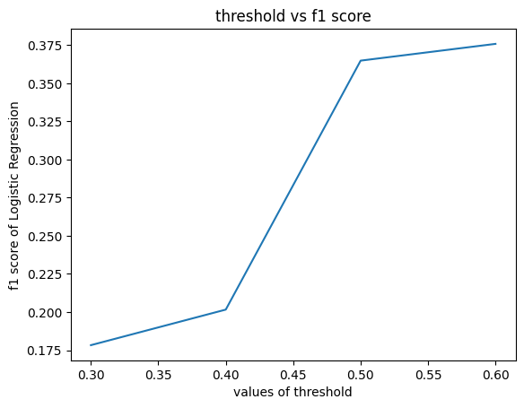
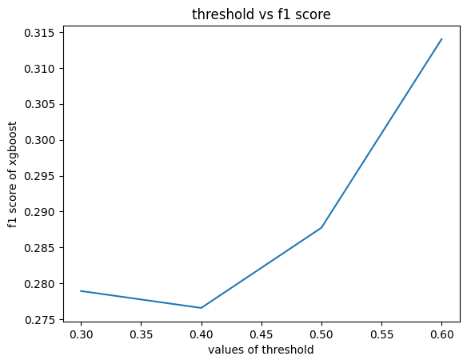

# banking-marketing-classification

Banking Marketing Dataset を用いて、顧客が定期預金を契約するかどうかを予測する分類モデルを構築した。

クラス不均衡を含むデータに対して、

* LightGBM
* Logistic Regression
* Support Vector Machine (SVM)

を比較し、前処理や `class_weight` の影響を検証した。

また、StackingClassifier を用いたアンサンブル学習も実施し、
単体モデルとの性能比較およびスタッキングの有効性を検証した。

## What I tried

* LightGBM
* Logistic Regression
* Support Vector Machine (SVM)
* Class Imbalance Handling (`class_weight`)
* Feature Scaling (`StandardScaler`)
* Ensemble Learning (Stacking)
* MLflow Experiment Tracking
* Recall / F1 Score Evaluation

## Data source

下記の公開データを使用した。

* [Hugging Face Datasets: banking-marketing](https://huggingface.co/datasets/Andyrasika/banking-marketing)

## 精度

## LightGBM

| 条件 | Accuracy | Recall | F1 |
|------|----------|--------|----|
| ベースライン | 0.92 | 0.56 | 0.63 |
| class_weight適用 | 0.89 | 0.62 | 0.57 |
| Recall重視設計 | 0.87 | 0.79 | 0.59 |

## Logistic Regression

| 条件 | Accuracy | Recall | F1 |
|------|----------|--------|----|
| ベースライン | 0.89 | 0.22 | 0.32 |
| class_weight適用 | 0.81 | 0.62 | 0.57 |
| Recall重視設計 | 0.83 | 0.79 | 0.52 |

## SVM

| 条件 | Accuracy | Recall | F1 |
|------|----------|--------|----|
| ベースライン | 0.88 | 0.007 | 0.01 |
| class_weight適用 | 0.77 | 0.72 | 0.42 |
| Recall重視設計 | 0.83 | 0.85 | 0.54 |

## Stacking Meta Model

| モデル | Accuracy | Recall | F1 |
|--------|----------|--------|----|
| Logistic Regression | 0.80 | 0.49 | 0.36 |
| XGBoost | 0.72 | 0.46 | 0.28 |

## Notes

### モデル比較

本検証では、顧客の定期預金の契約有無を予測する分類問題に対して、以下の3種類のモデルを比較した。

* LightGBM
* Logistic Regression
* Support Vector Machine (SVM)

それぞれ異なる学習アルゴリズムを採用することで、前処理やクラス不均衡への耐性の違いを確認した。

| モデル                 | 特徴               |
| ------------------- | ---------------- |
| LightGBM            | 木構造ベースの勾配ブースティング |
| Logistic Regression | 線形モデル            |
| SVM                 | 距離ベースの非線形モデル     |

---

### 前処理

各モデルに対して以下の前処理を実施した。

* カテゴリ変数のエンコーディング
* 外れ値のクリッピング
* クラス不均衡への対応（`class_weight`）
* `StandardScaler` による標準化（Logistic Regression・SVM）
* `pdays=-1` を「過去接触なしフラグ」と「経過日数」に分離

#### pdays の特徴量変換

`pdays` は以下の特殊な意味を持つ値を含む。

```text
-1 = 過去キャンペーンで接触履歴なし
```

そのため単純な数値として扱わず、

1. 過去接触の有無フラグ
2. 最終接触からの経過日数

の2つの特徴量へ分離した。

これにより、「接触履歴が存在しない」という情報と、「最後の接触から何日経過したか」という情報をそれぞれ学習できるようにした。

---

### クラス不均衡への対応

対象データは契約顧客の割合が少ない不均衡データである。

そのため Accuracy のみではなく、以下の指標を用いて評価を行った。

* Precision
* Recall
* F1 Score

#### 評価方針

今回の想定業務では、

> 契約する顧客をできるだけ取りこぼさない

ことを重視した。

そのため Accuracy ではなく Recall を主要評価指標として比較した。

一方で Recall を重視すると偽陽性が増加する可能性もあるため、実運用では Precision やマーケティング費用の面も考慮する必要がある。

---

### Accuracy だけではモデル性能を評価できない

SVM のベースラインモデルでは Accuracy が高かった一方で、Recall は 0.007 であり、契約顧客をほとんど検出できていなかった。

これは不均衡データにおいて、

> 「全員契約しない」

と予測するだけでも高い Accuracy が得られるという典型的な問題を示している。

この結果から、不均衡データでは Accuracy のみでモデル性能を評価してはいけないことを確認できた。

---

### class_weight の効果

Logistic Regression および SVM では、`class_weight` の適用によって Recall が大きく改善した。

これは少数クラスの誤分類に対するペナルティが強くなり、モデルが契約顧客をより積極的に検出するようになったためと考えられる。

---

### SVM は標準化の影響が非常に大きい

今回の検証で最も大きな改善が見られたのは SVM であった。

Recall は以下のように改善した。

```text
0.007 → 0.72 → 0.85
```

SVM は特徴量間の距離を利用して学習するため、特徴量スケールの影響を強く受ける。

そのため、標準化の有無が性能に大きく影響することを確認できた。

---

### LightGBM は前処理への依存が比較的小さい

LightGBM は標準化を必要とせず、ベースラインの時点で比較的高い性能を示した。

また、Recall を重視した設定では他モデルと同程度まで改善できたことから、不均衡データへの対応による効果も確認できた。

---

## アンサンブル学習（Stacking）の検証

本検証では、LightGBM・Logistic Regression・SVM の予測結果を統合するため、  
`StackingClassifier` を用いたアンサンブル学習を実施した。

ベースモデルには各モデルの Recall が高かった構成を採用し、メタモデルとして以下を比較した。

* Logistic Regression
* XGBoost

しかし、スタッキングによる性能向上は確認できず、単体モデルを上回る結果は得られなかった。

### 考えられる要因

多重共線性の影響を仮定し、予測確率の相関係数を確認したところ、モデル間には一定の相関が見られた。

| Model                 | LightGBM | Logistic Regression | SVM  |
|-----------------------|---------:|--------------------:|-----:|
| LightGBM              | 1.00     | 0.93                | 0.82 |
| Logistic Regression   | 0.93     | 1.00                | 0.89 |
| SVM                   | 0.82     | 0.89                | 1.00 |

ただし、相関が極端に高いわけでもなく、相関係数のみからスタッキング性能低下の原因を特定することは難しい

そのため、今回の結果については、以下のような複数の要因が考えられる。

* データセット規模が比較的小さいこと
* クラス不均衡の影響
* ベースモデル間の予測傾向が類似している可能性があること
* メタモデル学習用データの不足  
  （不均衡データであるため、交差検証によって各Foldの正例数がさらに減少する）
* メタモデル選択の影響  
  （特にXGBoostは学習データ量に対して複雑なモデルであり、過学習した可能性がある）

> 上記より、スタッキングが有効に機能しなかったことは確認できたが、単一要因によるものとは結論付けていない。

### 実運用時での判断

スタッキングは複数モデルの学習・推論が必要となるため、

* 計算コスト
* 実装の複雑さ
* モデル管理コスト

が増加する。

一方で、単体モデルでも Recall 0.79〜0.85 程度の性能が得られていた。

そのため、今回のケースでは無理にアンサンブル学習を採用する必要はないと判断した。

仮に性能がわずかに向上したとしても、そのためにシステムを複雑化するより、

* 推論速度
* 保守性
* 運用コスト
* モデル更新の容易さ

を優先する方が実務上は適切であると考えられる。

### Other Options

今回は検証していないが、アンサンブル学習の改善案として以下のような手法も考えられる。

#### Blending

スタッキング以外のアンサンブル手法として、各モデルの予測確率を平均する Blending が挙げられる。  
特に今回のように学習データ量が限られる場合は、メタモデルを追加学習する必要がないため、  
スタッキングより安定した結果が得られる可能性がある。

#### Feature Augmentation for Meta Model

メタモデルへの入力としてベースモデルの予測値だけでなく、元の特徴量も併せて利用する手法も考えられる。  
ベースモデルの予測結果だけでは表現できない情報を補完できる可能性があり、  
メタモデルの性能向上につながる場合がある。

#### ベースモデルの多様性

スタッキングでは、ベースモデル間の予測が多様であるほど、メタモデルがそれぞれの長所を活かしやすくなる場合がある。

今回の検証では、モデル比較を主目的としていたため、3つのベースモデルに対して基本的に共通の前処理と特徴量を用いた。  
その結果、各モデルの予測傾向が似通い、メタモデルが十分な追加情報を得られなかった可能性が考えられる。

改善案としては、モデルのアルゴリズムだけでなく、前処理や入力特徴量にも意図的に違いを持たせる方法が挙げられる。

例えば、

* 一部のモデルでは PCA による次元削減を適用する
* モデルごとに異なる特徴量セットを使用する
* 異なる特徴量エンジニアリングを施したデータで学習する

といった工夫により、ベースモデルの多様性が高まり、スタッキングの効果が向上する可能性がある。

---

## メタモデルの閾値調整

メタモデルでは、デフォルトの閾値（0.5）よりも
0.6付近の方が高いF1 Scoreを示した。

このように、分類モデルでは学習後の閾値調整によって、Recall や Precision を制御できるため、  
実運用時の要件に応じたチューニングが可能であることを確認した。

  

  

---

## Conclusion

本検証では、Banking Marketing Dataset を用いて分類モデルの比較と不均衡データへの対応を行った。

その結果、

* Accuracy のみでは性能評価できないこと
* `class_weight` が Recall 改善に有効であること
* SVM は標準化の影響を強く受けること
* LightGBM は比較的前処理に頑健であること
* Stacking が必ずしも性能向上につながるわけではないこと

を確認できた。

また、モデル精度だけでなく、

* 推論速度
* 保守性
* 運用コスト

といった実運用上の要素も含めてモデルを選択する重要性を確認できた。
