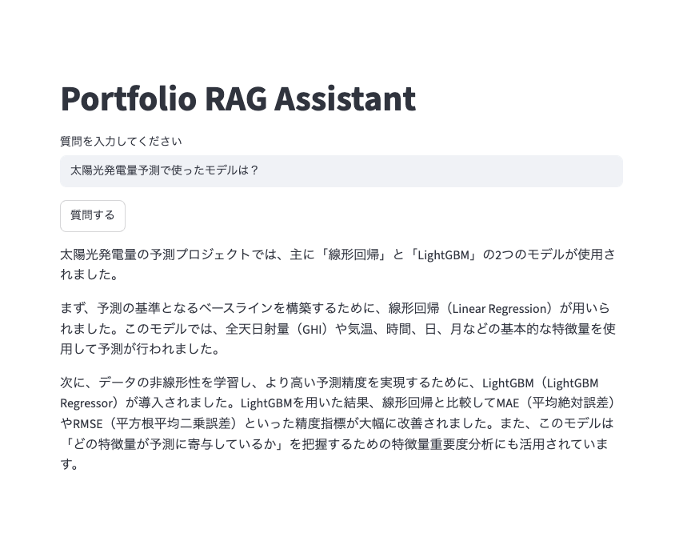

# portfolio-rag-assistant

ポートフォリオおよび ml-lab のプロジェクト情報を検索できる RAG（Retrieval-Augmented Generation）アシスタント。

SentenceTransformer による Embedding、ChromaDB によるベクトル検索、Gemini API による回答生成を組み合わせ、自然言語でポートフォリオ情報を検索できるシステムを構築した。

## What I tried

* SentenceTransformer による文章埋め込み（Embedding）
* cosine similarity を用いた類似度理解
* ChromaDB によるベクトル検索
* Chunking（chunk_size / chunk_overlap）
* Top-K Retrieval
* Gemini API を利用した回答生成
* Prompt Engineering
* Streamlit による Web UI
* RAG（Retrieval-Augmented Generation）実装
* Streamlit Cache によるモデルロード高速化

---

## Architecture

```text
User Query
    ↓
Embedding
    ↓
Vector Search (ChromaDB)
    ↓
Top-K Retrieval
    ↓
Context Generation
    ↓
Gemini API
    ↓
Answer
```

---

## Data Source

自作ポートフォリオプロジェクトの README / Knowledge Document を利用。

対象例：

* pv-forecasting
* electricity-demand-forecast
* demand-forecast-sagemaker-deploy
* weather-classification
* banking-marketing

---

## Technical Stack

### LLM

* Gemini API

### Embedding

* sentence-transformers
* paraphrase-multilingual-MiniLM-L12-v2

### Vector Database

* ChromaDB

### Framework

* Streamlit

---

## Notes

### Key Findings

#### Embedding Model

TF-IDF と SentenceTransformer を比較し、意味的な類似度検索の違いを確認。

#### Chunk Size

複数の Chunk Size を比較し、検索精度への影響を検証。

#### Top-K Retrieval

Top-K の値によって Retrieval 結果が変化することを確認。

#### Prompt Engineering

検索結果をそのまま出力するのではなく、自然な回答文として生成できるようプロンプトを調整。

#### Streamlit Optimization

`@st.cache_resource` を利用し、Embedding モデルの再ロードを防止。

これにより、アプリ再実行時のレスポンス速度を改善。

---

### 実行例

質問：

```text
LightGBMを使ったプロジェクトを教えて
```

回答：

```text
LightGBMを活用したプロジェクトには、主に電力需要予測、太陽光発電予測、およびマーケティングデータの分類といった複数の事例があります。

最も詳細な事例としては、東京電力管轄エリアの電力需要予測プロジェクトが挙げられます。このプロジェクトでは、表形式データに対して高い予測性能を持つLightGBMを採用し、気象データなどを組み合わせた特徴量エンジニアリングやSHAPによるモデル解釈を行っています。また、このモデルをAmazon SageMaker Serverless Inferenceへデプロイし、独自の推論用コンテナを用いてAPI化するMLOpsの実践も行われました。この際、モデルの精度向上により、平均絶対誤差（MAE）がベースラインの2176から1093へと大幅に改善されています。

太陽光発電の予測プロジェクト（pv-forecasting）では、非線形な関係を学習するためにLightGBM Regressorが活用されました。Optunaを用いたハイパーパラメータの最適化（num_leavesやlearning_rateなど）を行うことで、線形回帰モデルと比較して予測精度を大きく向上させています。

また、銀行のマーケティング予測プロジェクトでは、分類モデルとしてLightGBMが使用されました。ここではデータの標準化が不要である点やカテゴリ特徴量への強さを活かし、クラス比率を維持したデータ分割や、リコール（再現率）を重視した設定での検証が行われています。

これらのプロジェクトを通じて、LightGBMは予測精度の高さだけでなく、学習速度の速さや特徴量の重要度分析のしやすさを活かして、実用的な推論環境の構築まで幅広く活用されています。
```

---

## Streamlitによる実行画面

### Portfolio RAG Assistant




## 課題
* プロンプト改善
* Retrieval 精度向上
* Chat History 対応