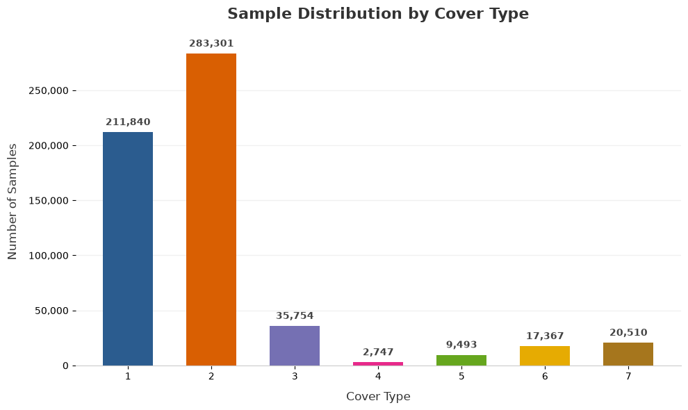

# covertype-feature-experiment

[Covertype Dataset](https://huggingface.co/datasets/mstz/covertype) を用いて、**データ量と特徴量数が機械学習モデルの性能にどのような影響を与えるか**を実験する。

今回は高い予測精度を追求することを目的とせず、

* 特徴量を減らすと、どの程度性能に影響するのか
* ランダムに特徴量を選択した場合、結果はどの程度ばらつくのか
* 学習データを減らすと、どの程度性能が低下するのか
* クラスによって性能低下の傾向に違いがあるのか

といった点を確認することを目的とした。  

---

## Dataset

[Covertype Dataset](https://huggingface.co/datasets/mstz/covertype)

森林の土地情報から、森林タイプ（`Cover_Type`）を7クラスに分類するデータセット。

約58万件のデータを持ち、54個の特徴量を使用する。

今回のデータセットには、`Wilderness_Area` や `Soil_Type` など、one-hot encoding とみなせるバイナリ特徴量が多数含まれている。

### Target distribution

目的変数は7クラスからなる多クラス分類問題だが、クラスごとのデータ数には大きな偏りがある。  
グラフを下記に示す。



<!-- | Cover Type | Samples |
| ---------: | ------: |
|          1 | 211,840 |
|          2 | 283,301 |
|          3 |  35,754 |
|          4 |   2,747 |
|          5 |   9,493 |
|          6 |  17,367 |
|          7 |  20,510 | -->

特にクラス4、5、6などはデータ数が少なく、学習データを減らした際にクラス不均衡の影響も受ける可能性がある。

そのため、本実験では**データ量の減少による影響と、クラス不均衡による影響を完全に分離することはできない**点に注意する。

---

## Experiment Theme

### 「そもそも、データ量や特徴量数はモデルにどう影響するのか？」

機械学習では、データ量や特徴量数がモデル性能に影響することはよく知られている。

一方で、

> 「どのくらい減らすと性能が崩れるのか？」
> 「特徴量を減らしたとき、すべてのクラスが同じように性能低下するのか？」
> 「大量のデータがあれば、少ない特徴量でも性能を維持できるのか？」

といった点は、実際にデータを使って確認してみないと分からない。

そこで今回は、モデルのチューニングによって最高精度を目指すのではなく、**条件を変えながらモデル性能の変化を観察する**。

---

## Method

### Data Split

基本的なデータ分割は以下の通り。

* 学習データ：60%
* 検証データ：20%
* テストデータ：20%

`train_test_split()` による層化分割を行い、テストデータと検証データは実験間で固定する。

学習データの量を変更する実験では、固定した学習データからさらにサンプリングすることで、学習データ量のみを変更する。

---

## Model

LightGBM の多クラス分類モデルを使用する。

```python
lgb.LGBMClassifier(
    objective="multiclass",
    num_class=7,
    class_weight="balanced",
    random_state=42,
    n_estimators=1000
)
```

Early Stopping を使用し、検証データを用いて学習を停止する。

クラス不均衡への対応として `class_weight="balanced"` を使用する。

---

# Experiment 1: Feature Number

54個ある特徴量のうち、使用する特徴量数を

* 10
* 20
* 30
* 40
* 54（baseline）

と変化させる。

### Feature selection

特徴量数を減らす際には、特定の特徴量の重要度による影響をできるだけ抑えるため、**ランダムサンプリング**を行う。

各特徴量数について50回試行し、各クラスの Precision / Recall / F1-score の平均を比較する。

1回のランダムサンプリングだけでは、

> 「特徴量数を減らした影響」なのか
> 「たまたま重要な特徴量を選んだ／外した影響」なのか

を区別しにくいため、複数回の試行結果を平均する。

---

## Feature sampling patterns

特徴量には、バイナリ特徴量とそれ以外の数値特徴量が存在する。

そのため、以下の2パターンを比較する。

### Pattern 1: 完全ランダム

54個の特徴量全体から、指定した数の特徴量をランダムに選択する。

### Pattern 2: Feature type ratio を維持

バイナリ特徴量と非バイナリ特徴量の元々の比率を維持した状態でランダムサンプリングする。

元データでは、

* バイナリ特徴量：44
* 非バイナリ特徴量：10
* およそ 8 : 2

となっている。

そのため、以下の割合でサンプリングする。

| Feature count | Binary | Non-binary |
| ------------: | -----: | ---------: |
|            10 |      8 |          2 |
|            20 |     16 |          4 |
|            30 |     24 |          6 |
|            40 |     32 |          8 |

両者を比較することで、特徴量の種類を考慮したサンプリング方法が結果に大きな影響を与えるかを確認する。

---

## 50回試行と95%信頼区間

特徴量数の実験では、各条件について50回のランダムサンプリングを行う。

各クラスについて、

* Precision
* Recall
* F1-score

の平均値と標準偏差を計算する。

さらに、50回の試行結果から95%信頼区間を計算し、ランダムな特徴量選択による結果のばらつきを確認する。

95%信頼区間は、

```text
mean ± 1.96 × (std / √n)
```

で計算する。

---

# Experiment 2: Data Size

特徴量をすべて使用したbaselineでは、学習データ量のみを変更する。

テストデータと検証データは20%ずつ固定し、学習データのみを全体に対して以下の割合に変更する。

* 50%
* 40%
* 30%
* 20%
* 10%
* 5%
* 1%
* 0.5%

つまり、データセット全体に対する学習データ量を段階的に減らし、モデル性能の変化を確認する。

この実験では特徴量選択によるランダム性がないため、seedを固定した1回の結果を使用する。

そのため、**この実験では信頼区間は算出していない**。

---

# Experiment 3: Feature Number × Data Size

特徴量数とデータ量の両方を変更する実験として、**特徴量30個に固定した状態で学習データ量を変更する**。

特徴量30個は、特徴量数の実験において全体として一定の性能を維持しながらも、クラスごとに性能低下が見られたため、データ量の影響を確認する対象として選択した。

特徴量30個は、バイナリ特徴量と非バイナリ特徴量の比率を維持したランダムサンプリングによって選択する。

各データ量について50回のランダムサンプリングを行い、

* Precision
* Recall
* F1-score
* 標準偏差
* 95%信頼区間

をクラスごとに確認する。

これにより、

**「特徴量を減らした状態で、さらにデータ量を減らすとどうなるのか」**

を確認する。

---

# Results

## 1. Feature Number

特徴量数を減らすと、全体として性能が低下する傾向が確認された。

特に40特徴量では比較的安定した結果が得られた一方、30特徴量以下ではクラスによって性能のばらつきが大きくなった。

完全ランダムサンプリングと、バイナリ／非バイナリの比率を維持したサンプリングを比較すると、**両者の結果には大きな乖離は見られなかった**。

一方、特徴量数が少なくなるほど、ランダムサンプリングによる結果のばらつきが大きくなる傾向が見られた。

例えば完全ランダムサンプリングでは、30特徴量のクラス5におけるF1-scoreの標準偏差は約0.136、10特徴量ではクラス5の標準偏差が約0.102となるなど、クラスや条件によって大きなばらつきが確認された。

50回の試行結果から計算した95%信頼区間については、特徴量数が多い場合には比較的狭い範囲に収まる一方、特徴量数を減らすと広がるケースが見られた。

これは、特徴量数が少なくなることで、

> 「どの特徴量を選ぶか」

による影響が相対的に大きくなっている可能性がある。

### Feature Number の結果から分かったこと

* 54 → 40特徴量では性能の大きな崩れは見られない
* 30特徴量以下ではクラスごとの差が目立つ
* 特徴量数を減らすほど、ランダムサンプリングによる結果のばらつきが大きくなる傾向がある
* 完全ランダムと、特徴量の種類の比率を維持したサンプリングでは、大きな結果の乖離は見られなかった
* 特徴量数が少ない場合、特徴量の選び方そのものが性能に与える影響が大きくなる可能性がある

---

## 2. Data Size

特徴量54個をすべて使用し、学習データ量のみを変更した結果、データ量が減少するにつれて性能が低下する傾向が確認された。

| Train data | Train samples | Accuracy | Macro F1 | Weighted F1 |
| ---------: | ------------: | -------: | -------: | ----------: |
|        60% |       348,607 |     0.92 |     0.90 |        0.92 |
|        50% |       290,505 |     0.94 |     0.93 |        0.94 |
|        40% |       232,404 |     0.94 |     0.92 |        0.94 |
|        30% |       174,303 |     0.94 |     0.91 |        0.94 |
|        20% |       116,202 |     0.93 |     0.90 |        0.93 |
|        10% |        58,101 |     0.91 |     0.87 |        0.91 |
|         5% |        29,051 |     0.88 |     0.82 |        0.87 |
|         1% |         5,811 |     0.78 |     0.67 |        0.78 |
|       0.5% |         2,906 |     0.74 |     0.62 |        0.74 |

50%～20%程度ではAccuracyやWeighted F1に大きな低下は見られなかった一方、10%以下になると性能低下が目立ち始めた。
特に0.5%まで学習データを減らすと、Macro F1は0.62、Weighted F1は0.74まで低下した。

Macro F1とWeighted F1の差を見ると、データ量が少なくなるほど、クラスごとの性能差が大きくなっていることが分かる。  
Weighted F1はデータ数の多いクラスの影響を強く受けるため、少数クラスで性能が大きく低下していても、  
全体のWeighted F1には反映されにくい。

そのため、本実験ではAccuracyやWeighted F1だけではなく、  
Macro F1やクラスごとのPrecision / Recall / F1-scoreも確認することで、  
データ量の減少が各クラスに与える影響を確認した。

---

## 3. Feature Number × Data Size

特徴量30個に固定してデータ量を変更したところ、データ量が少なくなるにつれてクラスごとの性能低下がより明確になった。

特にクラス5では、データ量の減少に伴ってRecallやF1-scoreが大きく低下した。

一方、クラス1・2・3など比較的データ数の多いクラスでは、データ量が減少しても比較的高い性能を維持する傾向が見られた。

このことから、

**データ量の減少による影響は、すべてのクラスに均一に現れるわけではない**

ことが確認できた。

また、50回の特徴量サンプリングによる95%信頼区間を確認すると、データ量が少ない条件ではクラスによってばらつきが大きくなる傾向も確認された。

---

# Observations

今回の実験を通して、以下のような傾向が確認できた。

### 1. 特徴量は「数」だけでなく「どの特徴量を残すか」が重要

特徴量を減らすほど、ランダムに選択した特徴量による性能差が大きくなる傾向が見られた。

特徴量数が十分に多い場合は、多少特徴量を入れ替えても性能が安定する一方、特徴量数が少なくなると、重要な特徴量を含むかどうかによる影響が大きくなると考えられる。

### 2. データ量を減らすと、特に少数クラスへの影響が大きい

データ量を減らすと全体のAccuracyも低下するが、クラスごとに見ると性能低下の程度には差があった。

特に元々のデータ数が少ないクラスでは、学習データの減少による影響が大きくなった。

### 3. 全体指標だけではデータ不足の影響を捉えにくい

AccuracyやWeighted F1だけを見ると、ある程度データ量を減らしても性能が維持されているように見える。

しかし、Macro F1やクラスごとのF1-scoreを見ることで、少数クラスの性能低下を確認できた。

### 4. データ量と特徴量数は独立した問題ではない

今回の実験では、特徴量30個に固定してデータ量を減らすことで、特徴量数を減らした状態でさらにデータ量が不足した場合の影響を確認した。

特徴量とデータ量を別々に見るだけでなく、

**「限られたデータ量に対して、どの程度の特徴量数が必要なのか」**

という観点でも考えることができる。

---

# Notes / Limitations

今回の実験では、目的変数が不均衡なデータセットを使用している。

そのため、学習データ量を減らした際の性能低下には、

* 単純な学習データ量の減少
* 少数クラスの学習データ数の減少
* クラス不均衡の影響

が含まれている可能性がある。

今回は「データ量が減ることでモデル性能がどう変化するか」というテーマを優先し、均衡した別データセットへの変更は行わない。

また、今回の目的は最高精度を達成することではない。

ハイパーパラメータチューニングや高度な特徴量エンジニアリングによってスコアを最大化するのではなく、**条件を変化させたときにモデルの挙動がどのように変わるのかを観察すること**を重視している。

---

# Experiment Structure

```text
01_eda.ipynb
    └─ データセットの確認・EDA

02_baseline.ipynb
    └─ 全特徴量を使用したbaseline

03_datasize_experiment.ipynb
    └─ 学習データ量を変更

04_features_experiment.ipynb
    └─ 特徴量数を変更
    └─ 完全ランダムサンプリング
    └─ Binary / Non-binary の比率を維持したサンプリング
    └─ 95%信頼区間の確認

05_features_datasize_experiment.ipynb
    └─ 特徴量30個に固定
    └─ 学習データ量を変更
    └─ 50回のランダムサンプリング
    └─ 95%信頼区間の確認
```

---

# Tech Stack

* Python
* pandas
* scikit-learn
* LightGBM
* math
* matplotlib
* seaborn

---

# Summary

本実験では、Covertype Datasetを用いて、**特徴量数と学習データ量がLightGBMの多クラス分類性能に与える影響**を確認した。

特に、単純な平均性能だけではなく、クラスごとの性能やランダムサンプリングによるばらつきにも着目した。

実験の結果、

* 特徴量数を減らすほど、特徴量の選び方による性能差が大きくなる傾向
* 40特徴量程度では比較的安定した性能
* 30特徴量以下ではクラスごとの性能差が目立つ
* 学習データ量を減らすと性能が低下する
* 特に少数クラスで性能低下が大きくなる
* Accuracyなどの全体指標だけでは、少数クラスの性能低下を捉えにくい

といった傾向を確認できた。  
注）ただし、今回使用したデータセットの結果である、という点は留意したい。

今回は精度の最大化ではなく、**「データ量や特徴量数を変えると、モデルはどのように変化するのか？」という問いを実験によって確認すること**を目的とした。
