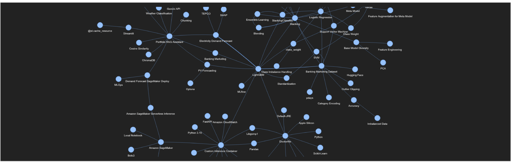

# Knowledge Graph RAG

LightRAGを用いたKnowledge Graph RAGの構築と、通常のRAGとの比較検証。

## Overview

通常のRAGでは、質問に関連する文章をベクトル検索によって取得し、その内容をもとにLLMが回答を生成する。

一方、Knowledge Graph RAGでは、文書中の**エンティティやそれらの関係性をグラフとして構造化**することで、複数の文書・プロジェクトにまたがる情報や、全体的な関係性を考慮した検索を試すことができる。

本プロジェクトでは、これまで作成したポートフォリオのREADMEを対象に、[LightRAG](https://github.com/HKUDS/LightRAG)を用いてKnowledge Graph RAGを構築した。

また、同じ質問を通常のRAGにも与え、**どのような質問で両者の回答が変わるのか**を比較した。

---

## Purpose

著者は、 `portfolio-rag-assistant` では、Sentence TransformersによるEmbeddingとChromaDBによるベクトル検索を利用した通常のRAGを構築した。  
[portfolio-rag-assistantへのリンク](https://github.com/usapyon549/ml-lab/blob/main/projects/004-portfolio-rag-assistant/README.md)

今回はその発展として、

> **「文書間の関係性を考慮すると、RAGの回答はどのように変わるのか？」**

を確認することを目的とした。

特に、以下のような質問に対する挙動に注目した。

* 特定のプロジェクトについて尋ねる質問
* 複数プロジェクトに共通する要素を尋ねる質問
* ポートフォリオ全体のテーマや関係性を尋ねる質問

---

## Why LightRAG?

当初はKnowledge Graph RAGの実装としてMicrosoft GraphRAGも候補として検討した。

しかし、GraphRAGではインデックス構築の計算コストが大きく、今回利用しているGemini APIの無料枠にも制約があるため、軽量に試行しやすいLightRAGを採用した。

LightRAGでは、Knowledge Graphを利用した検索を比較的シンプルな構成で試すことができ、今回の「通常RAGとの違いを確認する」という目的にも適していると判断した。

---

## Architecture

今回の構成は以下の通り。

```text
Portfolio README
      │
      ▼
  LightRAG
      │
      ├── Entity / Relation Extraction
      │        │
      │        ▼
      │   Knowledge Graph
      │
      └── Embedding
             │
             ▼
          Ollama
          BGE-M3
             │
             ▼
        Hybrid Retrieval
             │
             ▼
        Gemini API
             │
             ▼
           Answer
```

### Components

| Component              | Technology       |
| ---------------------- | ---------------- |
| RAG framework          | LightRAG         |
| LLM                    | Gemini API       |
| Embedding              | BGE-M3           |
| Local inference        | Ollama           |
| Vector / Graph storage | LightRAG         |
| Graph visualization    | NetworkX / PyVis |
| Execution environment  | Google Colab     |

EmbeddingにはOllama上で `BGE-M3` を使用し、LLMによるエンティティ・関係抽出や回答生成にはGemini APIを使用した。

Gemini APIの利用回数を抑えるため、Embeddingはローカルで実行している。

---

## Knowledge Graph

READMEをLightRAGへ投入することで、プロジェクト・モデル・ライブラリ・AWSサービスなどのエンティティと、それらの関係がKnowledge Graphとして構築される。

構築されたグラフはNetworkXで読み込み、PyVisを用いて可視化した。

### Network Graph



> ※ 実際のグラフ画像を `figs/lightrag_graph.png` に配置する。

グラフを確認すると、`LightGBM` や `Stacking` など、複数のプロジェクトで明示的に記述されている技術が複数のノードと接続され、関係の中心となっていることが確認できた。

一方、`Python` や `MacBook` など、実際の開発環境として使用していた要素が必ずしも同じような中心性を持つわけではなかった。

このことから、Knowledge Graph RAGでは、**入力された文書にどのような情報・関係が明示されているかが、構築されるグラフに大きく影響する**ことも確認できた。

---

# Comparison with Normal RAG

同じポートフォリオ情報を対象として、通常RAGとLightRAGに同じ質問を与え、回答を比較した。

比較では、すべての質問結果を掲載するのではなく、両者の違いが分かりやすい代表例を取り上げる。  
(回答全件は、comarison.mdに掲載する)

---

## Case 1: Similar Answers

### Query

> 太陽光発電量予測で使ったモデルは？

### Normal RAG

通常RAGでは、太陽光発電量予測プロジェクトについて、線形回帰とLightGBMを使用したこと、それぞれのMAE・RMSEなどを説明する回答が得られた。

### LightRAG

LightRAGでも、太陽光発電量予測でLightGBMを使用したことや、初期段階で線形回帰を検討したこと、Optunaによるチューニングを行ったことなどが回答された。

### Observation

このような**特定のプロジェクトに対する一問一答型の質問**では、通常RAGでも十分に回答が成立しており、LightRAGによる大きな差は見られなかった。

このような用途では、より構築がシンプルで回答も簡潔になりやすい通常RAGのほうが適している場合もあると考えられる。

---

## Case 2: Different Answers

### Query

> ポートフォリオのテーマの推移は？

### Normal RAG

通常RAGでは、検索された文章の内容から、SNSコメント分析プロジェクト内部における分析テーマの変化として解釈された。

そのため、ポートフォリオ全体のプロジェクトを横断した「テーマの推移」という質問に対しては、意図とは異なる方向の回答となった。

### LightRAG

LightRAGでは、複数のプロジェクト間の関係を踏まえ、

```text
時系列予測
    ↓
MLOps・デプロイ
    ↓
分類・実運用
    ↓
LLMによるテキスト分析
    ↓
RAGによる統合・検索
```

という、ポートフォリオ全体のテーマの発展として回答された。

### Observation

この質問では、**複数のプロジェクトを横断して全体像を捉える必要があるため、通常RAGとLightRAGで回答の方向性に明確な違いが見られた。**

---

## Comparison Summary

今回の比較から、以下のような使い分けが考えられる。

| Question type      | Normal RAG | Knowledge Graph RAG |
| ------------------ | ---------: | ------------------: |
| 特定文書・プロジェクトについての質問 |          ◎ |                   ◎ |
| 特定技術を使用したプロジェクトの検索 |          ○ |                   ◎ |
| 複数プロジェクトの共通点       |          △ |                   ◎ |
| 全体のテーマ・関係性         |          △ |                   ◎ |
| 全体を横断した推論          |          △ |                   ◎ |

あくまで今回の小規模な比較における所感ではあるが、

> **一問一答に近い質問では通常RAG、複数の文書・プロジェクトを横断して関係性や全体像を捉えたい場合にはKnowledge Graph RAG**

という使い分けが考えられる。

また、LightRAGのほうが常に優れているというわけではなく、単純な質問では通常RAGのほうが回答が簡潔で分かりやすい場合もあった。

---

# What I Learned

今回の実験では、通常RAGとKnowledge Graph RAGの検索方式の違いだけでなく、**「そもそもKnowledge Graphに何が存在するのか」**という点も興味深い結果となった。

グラフを可視化すると、LightGBMやStackingなど、複数のプロジェクトで明示的に記述されている技術が関係の中心となっていた。

一方で、実際には使用していたPythonやMacBookなどが、必ずしも同じような中心的ノードとして現れるわけではなかった。

これは、

> **Knowledge Graph RAGを構築したとしても、元の文書に記述されていない情報が自動的にKnowledge Graphへ追加されるわけではない**

ことを示している。

そのため、実際の業務でKnowledge Graph RAGを利用する場合には、検索方式だけでなく、

* 使用している技術
* プロジェクト間の関係
* システム構成
* 前提条件
* 業務上重要な属性

などを、**元となるナレッジに適切に記述しておくことが重要**だと感じた。

---

## Limitations

今回の比較は、ポートフォリオのREADMEという比較的小規模なデータセットを対象とした検証であり、一般的なRAG・Knowledge Graph RAGの性能を評価したものではない。

また、質問数も限定的であり、回答の評価についても主観的な比較である。

そのため、今回の結果は、

> 「LightRAGのほうが通常RAGより高性能である」

という結論ではなく、

> **「今回のデータと質問では、質問の種類によって両者の得意な領域に違いが見られた」**

という実験結果として捉えている。

---

## Future Work

今後は以下のような検証も考えられる。

* より大規模なドキュメントでの比較
* 質問数を増やした定量的な評価
* Retrieval結果そのものの比較
* Graph構築前後での回答品質の比較
* Knowledge Graphの更新・追加に対する挙動の確認
* Graphのサブグラフを利用した検索結果の可視化

---

## Related Project

通常のRAGによるポートフォリオ検索システム：

* `portfolio-rag-assistant`

本プロジェクトでは、上記の通常RAGをベースとして、Knowledge Graphを利用した検索との違いを検証した。

---

## Tech Stack

* Python
* LightRAG
* Gemini API
* Ollama
* BGE-M3
* NetworkX
* PyVis
* Google Colab
